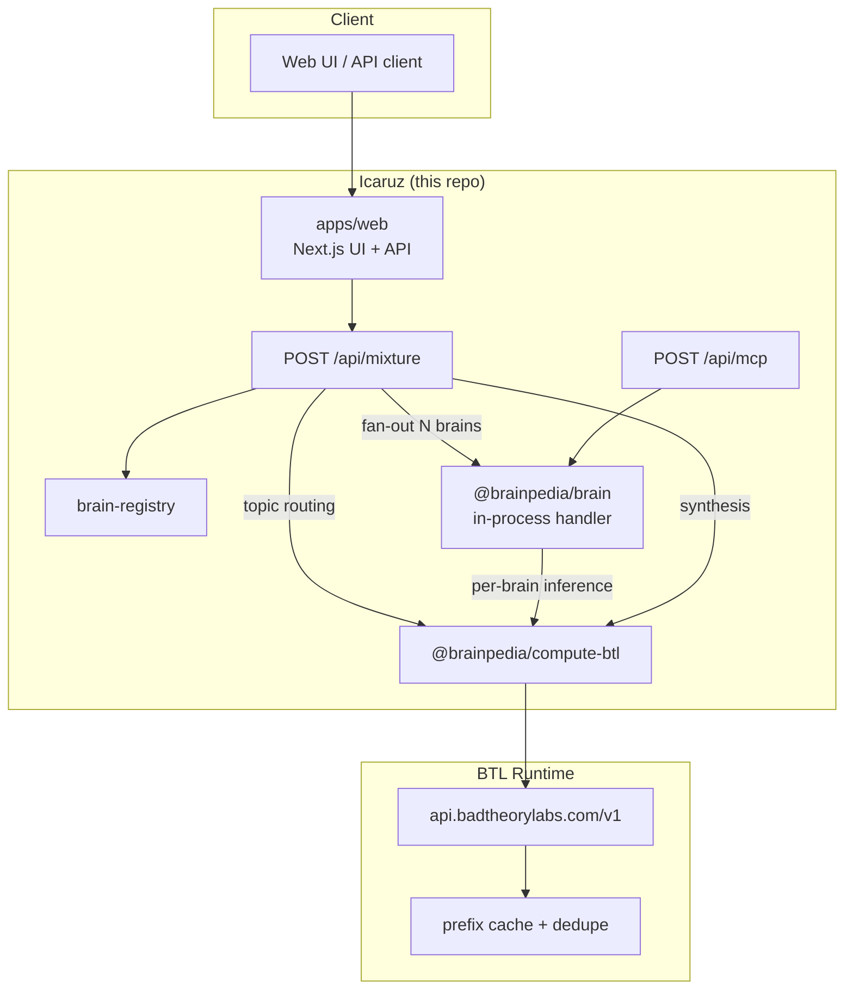
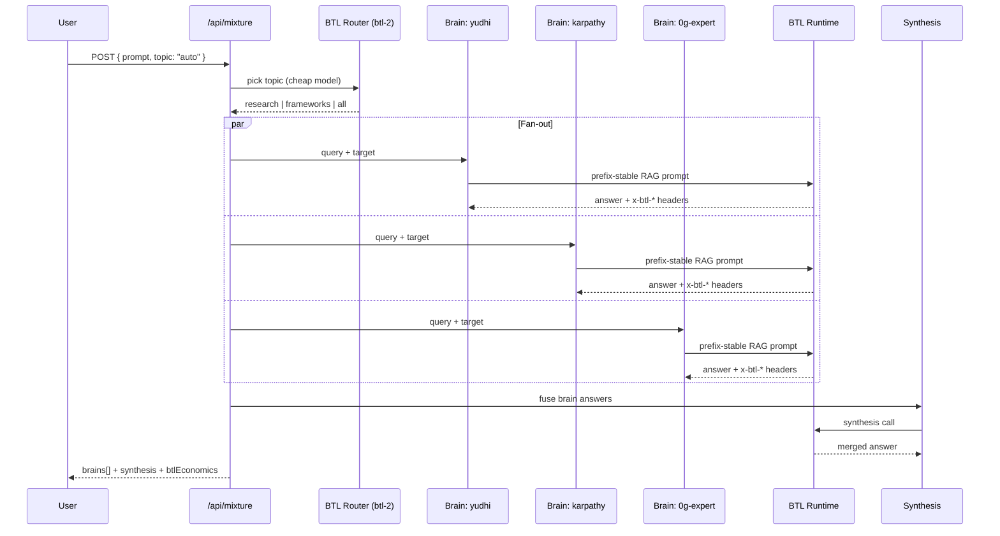
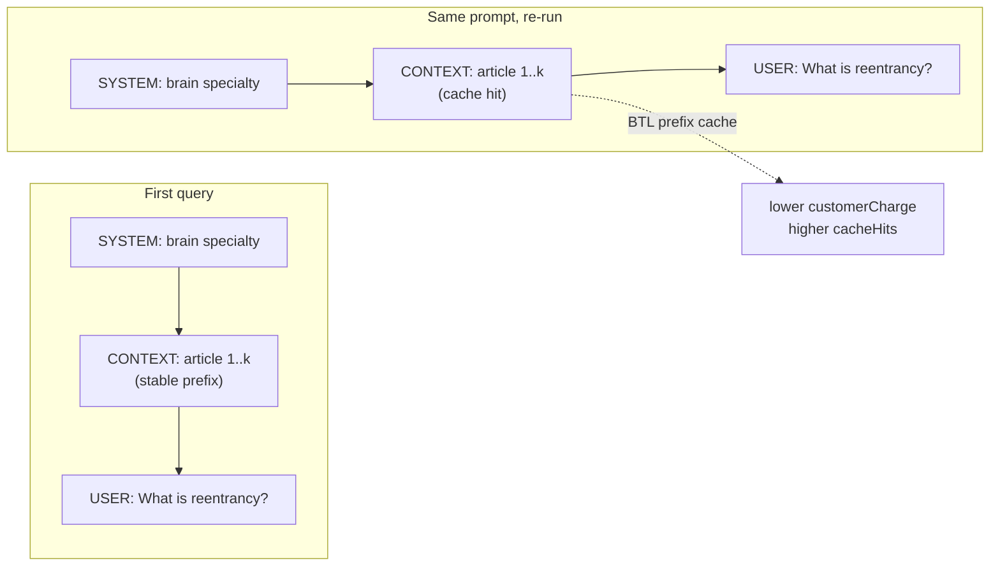

# Icaruz

**Cache-aware mixture-of-brains on [BTL Runtime](https://runtime.badtheorylabs.com/).**

Icaruz fans one agent prompt across multiple specialist knowledge brains. Each brain retrieves wiki context, builds a **prefix-stable RAG prompt**, and calls BTL. On repeat queries, BTL's prefix cache and retrieval dedupe cut cost — and every call returns verifiable economics in `x-btl-*` headers.

> Built for the BTL hackathon. Not a base-URL swap: we structure prompts so mixture fan-out benefits from BTL's cache layer.

---

## The problem

Multi-expert agents are expensive by design. A mixture query hits N brains in parallel. Each call resends the same wiki articles as context. Standard gateways bill that context N times. There is no ledger that proves what you saved.

## The solution

Icaruz separates **stable wiki prefix** from **volatile user question**, routes cheap classification through a small model, and aggregates per-brain BTL economics into one receipt.

| Layer | What it does |
|---|---|
| **Brains** | Specialist wikis (security, frameworks, docs). Top-K article retrieval per query. |
| **BTL Runtime** | Inference gateway with prefix cache, chunk dedupe, and per-request economics. |
| **Mixture API** | Fans out to N brains, synthesises answers, returns a savings ledger. |

---

## How it works

### System overview



### Mixture query sequence



### Why prefix-stable RAG matters

BTL caches by prompt prefix. Icaruz keeps wiki context in a fixed block; only the user question changes between runs.



**Demo trick:** run the same prompt twice. Watch `cacheHits` climb in the UI receipt strip.

---

## BTL economics

Every brain call through BTL returns headers the client parses into a ledger:

| Header | Meaning |
|---|---|
| `x-btl-request-id` | Request trace ID |
| `x-btl-cache-tier` | Cache tier used (empty = miss) |
| `x-btl-benchmark-cost` | What you would have paid at list price |
| `x-btl-customer-charge` | What BTL charged |
| `x-btl-saved` | Benchmark minus charge |

`POST /api/mixture` aggregates these into `btlEconomics`:

```json
{
  "calls": 4,
  "cacheHits": 2,
  "totalBenchmarkCost": 0.000048,
  "totalCustomerCharge": 0.000132,
  "totalSaved": 0.000016,
  "savingsRate": 0.33,
  "byCacheTier": { "prefix": 2 }
}
```

Preview cost without running inference:

```bash
curl "http://localhost:3000/api/mixture?quote=1&prompt=What+is+reentrancy&topic=research"
```

---

## Local brains

No chain, no ENS. Three demo specialists ship in `apps/web/src/lib/brain-registry.ts`:

| Brain | Specialty | Topics |
|---|---|---|
| `yudhi` | EVM security, audits, incidents | research, all |
| `karpathy` | LLM wikis, knowledge management | frameworks, all |
| `0g-expert` | Storage, compute, chain docs | research, all |

Topic routing (`topic: "auto"`) uses `BTL_ROUTER_MODEL` to pick the best catalog slice before fan-out.

---

## Quick start

**Requirements:** [Bun](https://bun.sh), a [BTL workspace key](https://runtime.badtheorylabs.com/), one terminal.

```bash
git clone https://github.com/arko05roy/Icaruz.git
cd Icaruz
bun install

cp .env.example .env
# Set GATEWAY_API_KEY=gw_...
# Set ZG_WALLET_PRIVATE_KEY, BRAIN_ENS_NAME, BRAIN_STORAGE_ROOT, BRAIN_SPECIALTY
```

**Web app** (UI + mixture API + in-process brain handler):

```bash
bun run dev --filter=@brainpedia/web
```

Open http://localhost:3000 → scroll to **mixture query** → run demo.

Health check: http://localhost:3000/status

---

## Environment

Minimum for the BTL demo (root `.env`, loaded by the web app):

```bash
GATEWAY_API_KEY=gw_your_btl_workspace_key
BTL_RUNTIME_BASE_URL=https://api.badtheorylabs.com/v1
BTL_QUERY_MODEL=btl-2
BTL_ROUTER_MODEL=btl-2
ZG_WALLET_PRIVATE_KEY=0x...
BRAIN_ENS_NAME=yudhi.bpedia.eth
BRAIN_STORAGE_ROOT=0x...          # optional; offline demo articles used if 0G fetch fails
BRAIN_SPECIALTY=EVM security, audit methodology, incident post-mortems
BRAIN_ENFORCE_ACCESS_TOKENS=false
```

Full template: [`.env.example`](.env.example)

---

## API

### `POST /api/mixture`

```bash
curl -X POST http://localhost:3000/api/mixture \
  -H 'content-type: application/json' \
  -d '{"prompt":"What is reentrancy?","topic":"auto"}'
```

| Field | Values |
|---|---|
| `prompt` | User question (required) |
| `topic` | `auto` · `all` · `research` · `frameworks` |

Response includes `brains[]` (per-brain answers + `btl` economics), `synthesis`, and `btlEconomics` aggregate.

### `POST /api/brain`

Single-brain query for `/[name]` pages:

```bash
curl -X POST http://localhost:3000/api/brain \
  -H 'content-type: application/json' \
  -d '{"prompt":"Explain LLM wikis","target":"karpathy"}'
```

---

## Repository layout

```
Icaruz/
├── apps/
│   ├── web/                 Next.js UI + /api/mixture + /api/brain + /api/mcp
│   ├── brain/               Standalone brain HTTP server (legacy; optional for AXL mesh)
│   └── mcp-server/          Claude MCP tools (legacy write path)
├── packages/
│   ├── compute-btl/         BTL Runtime client, economics, router  ← hackathon core
│   ├── knowledge-compiler/  Vault → compiled wiki articles
│   ├── storage-0g/          Snapshot fetch (optional; demo fallback built in)
│   └── compute-0g/          Legacy inference path (unused when GATEWAY_API_KEY set)
├── scripts/demo/            Sample vault markdown for local demos
└── contracts/               Legacy on-chain Brain iNFT (not on hot path)
```

---

## Tech stack

| Layer | Choice |
|---|---|
| Monorepo | Bun workspaces + Turborepo |
| Web | Next.js 15, Tailwind, Route Handlers (API backend) |
| Inference | [BTL Runtime](https://runtime.badtheorylabs.com/docs) (`btl-2`) |
| Brain transport | In-process handler + JSON-RPC at `/api/mcp` |

---

## Hackathon pitch (30 seconds)

1. **Problem:** Mixture-of-experts agents rebill the same wiki context on every brain call.
2. **Insight:** Split stable prefix (articles) from volatile tail (question). Structure prompts for BTL's cache.
3. **Product:** Icaruz — mixture fan-out with a live economics receipt. Re-run the demo; savings are visible.
4. **Proof:** `x-btl-*` headers on every call, aggregated in `btlEconomics`, rendered as a thermal receipt in the UI.

---

## Links

- **Repo:** https://github.com/arko05roy/Icaruz
- **BTL Runtime:** https://runtime.badtheorylabs.com/
- **BTL API docs:** https://runtime.badtheorylabs.com/docs

---

## License

MIT
