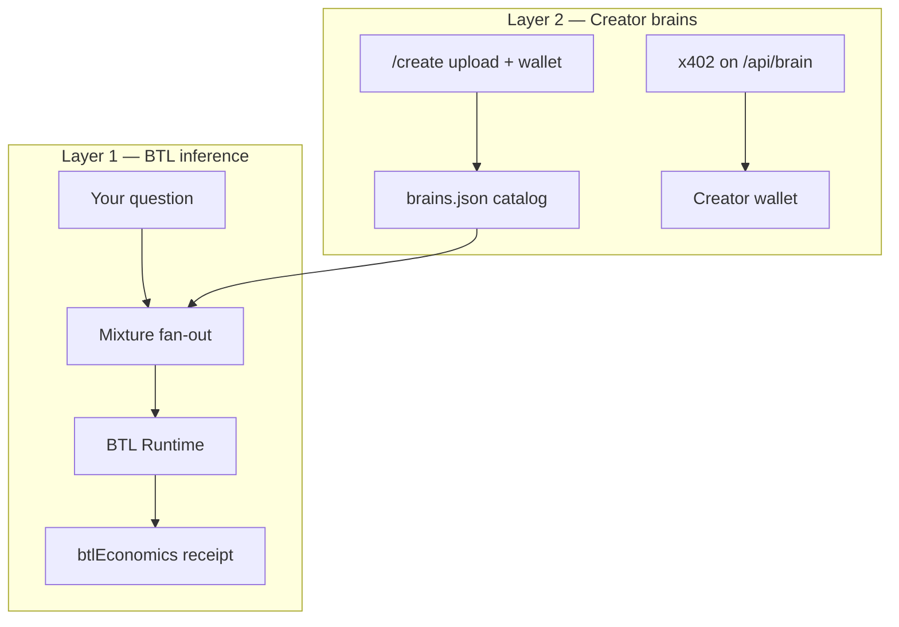
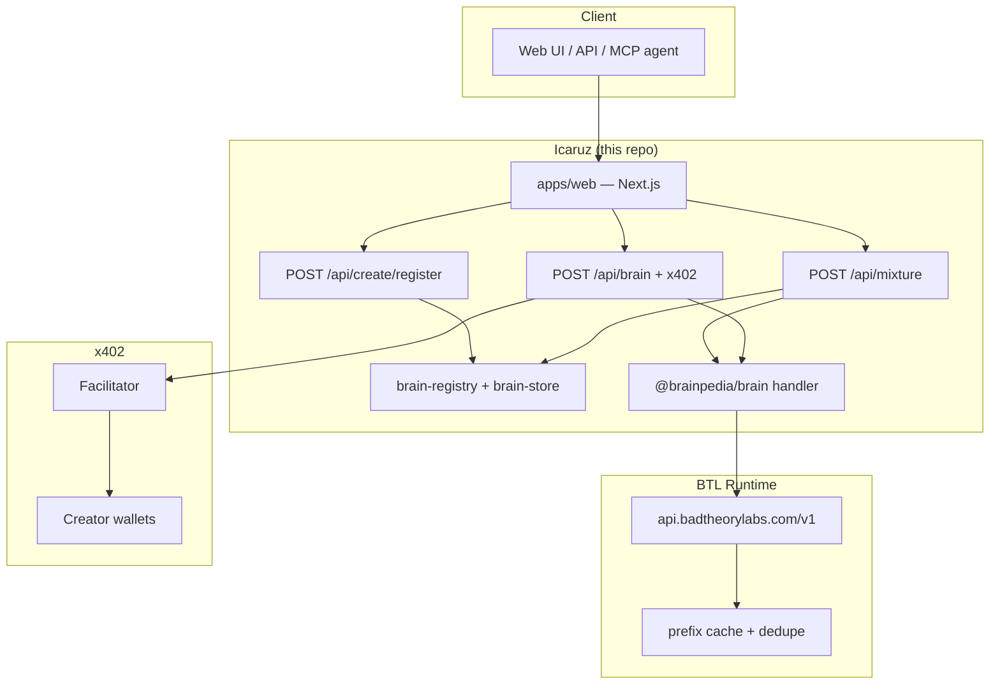
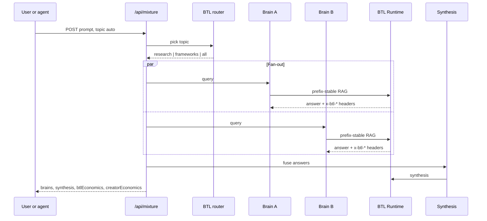
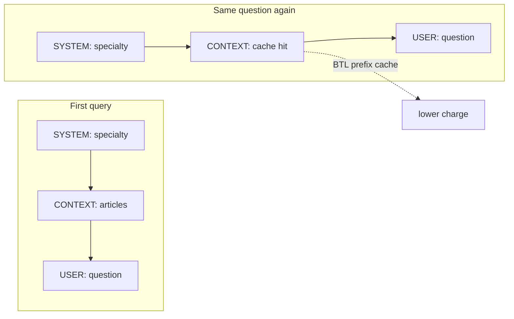

# Icaruz

**Ask many experts at once. Pay less for AI. Let experts get paid when their knowledge is used.**

Icaruz is a web app and API that routes one question to several specialist “brains” (curated knowledge bases), merges their answers, and shows you exactly what inference cost — and what you saved. Experts can publish their own brains, set a wallet address, and earn a small fee per query when agents use them.

Built on [BTL Runtime](https://runtime.badtheorylabs.com/) for cheap, cache-aware inference. Creator payouts use [x402](https://www.x402.org/) micropayments (USDC on Base).

---

## In plain English

| Who you are | What Icaruz does for you |
|---|---|
| **Someone with a question** | Type a prompt at [/ask](http://localhost:3000/ask). Icaruz picks relevant specialists, asks them in parallel, and gives you one combined answer plus a receipt showing AI cost and savings. |
| **Someone with expertise** | Upload notes (markdown, PDF, Word) at [/create](http://localhost:3000/create). Name your brain, paste a wallet, set a price (e.g. $0.01 per query). It joins the catalog; agents pay you when they query it. |
| **A developer / agent** | Call `POST /api/mixture` for multi-brain answers + `btlEconomics`. Call `POST /api/brain` for one brain; priced brains return HTTP 402 until x402 payment is attached. Use the `query_brain_x402` MCP tool for automatic pay-and-retry. |

**The mental model:** Think of a panel of specialists in a room. You ask once; they answer in parallel; a moderator synthesizes. BTL keeps the “reading the same reference docs” part cheap on repeat. x402 sends pennies to whoever owned the docs.

---

## Two layers (how the money flows)



| Layer | Who pays | Typical amount | What you get |
|---|---|---|---|
| **BTL** | Platform / querier (your `GATEWAY_API_KEY`) | Fractions of a cent per call | Fast inference + prefix cache + `x-btl-*` proof headers |
| **Creator** | Agent or API client (x402) | ~$0.01–0.02 per brain query | Direct payout to the brain owner’s wallet |
| **Demo UI** | Nobody extra | $0 | `X402_SKIP_PAYMENT=true` skips x402 so humans can try the app without a wallet |

BTL makes the *inference* cheap. x402 makes the *expertise* payable. On a mixture query you see **two receipts**: BTL savings and creator royalties (informational in the UI; agents settle per brain via x402).

---

## The technical problem (why this exists)

Multi-expert agents are expensive by design. A mixture query hits N brains in parallel. Each call resends the same wiki articles as context. Standard gateways bill that context N times. There is no ledger that proves what you saved — and no simple way for the human who wrote those articles to earn when an agent uses them.

## The technical solution

1. **Prefix-stable RAG** — Wiki context stays in a fixed prompt block; only the user question changes. BTL’s prefix cache and chunk dedupe hit on repeat queries.
2. **Mixture orchestration** — Cheap router model picks a topic; fan-out queries N brains; synthesis merges answers.
3. **Creator catalog** — Uploaded knowledge compiles to articles, stored locally (and optionally on 0G). Registry in `apps/web/data/brains.json`.
4. **x402 gate** — Priced brains on `POST /api/brain` return HTTP 402 until payment; settlement goes to `payoutWallet`.

---

## How it works

### System overview



### Mixture query sequence



### Why prefix-stable RAG matters

BTL caches by prompt prefix. Icaruz keeps wiki context in a fixed block; only the user question changes between runs.



**Try it:** Run the same prompt twice on [/ask](http://localhost:3000/ask). Watch `cacheHits` climb in the BTL receipt.

---

## Brains catalog

### Built-in demo brains

Ship in [`apps/web/src/lib/brain-registry.ts`](apps/web/src/lib/brain-registry.ts). No wallet required to query in demo mode.

| Brain | Specialty | Topics |
|---|---|---|
| `yudhi` | EVM security, audits, incidents | research, all |
| `karpathy` | LLM wikis, knowledge management | frameworks, all |
| `0g-expert` | Storage, compute, chain docs | research, all |

### Creator brains

Anyone can publish via [/create](http://localhost:3000/create):

1. Connect wallet (payout address).
2. Upload files → preview compile.
3. Set name, specialty, topics, price (default $0.01).
4. Brain is written to `apps/web/data/brains.json` and snapshots under `data/snapshots/`.

Creator brains appear in [/brains](http://localhost:3000/brains) and in mixture fan-out when their topic matches.

Topic routing (`topic: "auto"`) uses `BTL_ROUTER_MODEL` to pick `research`, `frameworks`, or `all` before fan-out.

---

## BTL economics

Every brain call through BTL returns headers parsed into a ledger:

| Header | Meaning |
|---|---|
| `x-btl-request-id` | Trace ID |
| `x-btl-cache-tier` | Cache tier (empty = miss) |
| `x-btl-benchmark-cost` | List-price equivalent |
| `x-btl-customer-charge` | What BTL charged |
| `x-btl-saved` | Benchmark minus charge |

`POST /api/mixture` aggregates into `btlEconomics`:

```json
{
  "calls": 4,
  "cacheHits": 2,
  "totalBenchmarkCost": 0.000048,
  "totalCustomerCharge": 0.000132,
  "totalSaved": 0.000016,
  "savingsRate": 0.33,
  "byCacheTier": { "prefix": 2 }
}
```

Dry-run quote (no inference):

```bash
curl "http://localhost:3000/api/mixture?quote=1&prompt=What+is+reentrancy&topic=research"
```

---

## Creator economics (x402)

Mixture responses include `creatorEconomics` — per-brain wallet, price, and settlement hint:

```json
{
  "brains": [
    { "id": "defi-auditor", "name": "defi-auditor", "wallet": "0x…", "priceUsd": 0.01, "paid": false }
  ],
  "totalUsd": 0.01,
  "x402": {
    "endpoint": "/api/brain",
    "instructions": "POST { prompt, target } per brain. Pay via x402, retry with payment header."
  }
}
```

**Single-brain agent flow:**

1. `POST /api/brain` with `{ "prompt", "target" }`.
2. If priced and unpaid → **402** with payment requirements.
3. Agent signs USDC payment (Base Sepolia by default), retries with `X-PAYMENT` / `payment-signature` header.
4. **200** with answer + `creatorEconomics`.

**Demo bypass:** `X402_SKIP_PAYMENT=true` in `.env`, or header `x-demo-access: btl-hackathon` for the web UI.

**MCP:** `query_brain_x402` in `apps/mcp-server` runs the 402 → pay → retry loop using `ZG_WALLET_PRIVATE_KEY`.

---

## Quick start

**You need:** [Bun](https://bun.sh), a [BTL workspace key](https://runtime.badtheorylabs.com/), one terminal.

```bash
git clone https://github.com/arko05roy/Icaruz.git
cd Icaruz
bun install

cp .env.example .env
```

**Minimum `.env` for local demo:**

```bash
GATEWAY_API_KEY=gw_your_btl_workspace_key
BTL_RUNTIME_BASE_URL=https://api.badtheorylabs.com/v1
BTL_QUERY_MODEL=btl-2
BTL_ROUTER_MODEL=btl-2

ZG_WALLET_PRIVATE_KEY=0x...          # brain handler + optional 0G upload
BRAIN_ENS_NAME=yudhi.bpedia.eth
BRAIN_STORAGE_ROOT=0x...             # optional; demo articles if fetch fails
BRAIN_SPECIALTY=EVM security, audit methodology, incident post-mortems
BRAIN_ENFORCE_ACCESS_TOKENS=false

X402_SKIP_PAYMENT=true               # humans try UI without paying
```

**Run the web app:**

```bash
bun run dev --filter=@brainpedia/web
```

| URL | What |
|---|---|
| http://localhost:3000 | Landing |
| http://localhost:3000/ask | Mixture query + dual receipts |
| http://localhost:3000/brains | Brain catalog |
| http://localhost:3000/create | Publish a creator brain |
| http://localhost:3000/status | Health check |

---

## API reference

### `POST /api/mixture`

Multi-brain fan-out + synthesis. Full answers; no x402 gate on this path (platform pays BTL).

```bash
curl -X POST http://localhost:3000/api/mixture \
  -H 'content-type: application/json' \
  -d '{"prompt":"What is reentrancy?","topic":"auto"}'
```

| Field | Values |
|---|---|
| `prompt` | User question (required) |
| `topic` | `auto` · `all` · `research` · `frameworks` |

Response: `brains[]`, `synthesis`, `btlEconomics`, `creatorEconomics`.

### `POST /api/brain`

Single-brain query. x402 required for priced creator brains (unless skip env/header).

```bash
curl -X POST http://localhost:3000/api/brain \
  -H 'content-type: application/json' \
  -H 'x-demo-access: btl-hackathon' \
  -d '{"prompt":"Explain LLM wikis","target":"karpathy"}'
```

### `POST /api/create/register`

Multipart: `owner`, `payoutWallet`, `name`, `specialty`, `priceUsd`, `topics`, `files[]`. Compiles knowledge, saves snapshot, registers brain.

### `POST /api/create?step=preview`

Preview compilation only (no register). Same multipart `files` + `owner`.

---

## Repository layout

```
Icaruz/
├── apps/
│   ├── web/                 Next.js UI, mixture/brain/create APIs, x402
│   │   └── data/            brains.json + snapshots/ (creator catalog)
│   ├── brain/               In-process query handler (used by web)
│   └── mcp-server/          Claude MCP tools incl. query_brain_x402
├── packages/
│   ├── compute-btl/         BTL client, economics, router
│   ├── knowledge-compiler/  Files → wiki articles
│   ├── storage-0g/          Optional 0G snapshot upload/fetch
│   └── ens/                 Legacy ENS path (not hot path for demo)
├── scripts/demo/            Sample vault markdown
└── contracts/               Legacy Brain iNFT (dormant in BTL demo mode)
```

---

## Tech stack

| Layer | Choice |
|---|---|
| Monorepo | Bun workspaces + Turborepo |
| Web | Next.js 15, Tailwind, App Router |
| Inference | [BTL Runtime](https://runtime.badtheorylabs.com/docs) (`btl-2`) |
| Creator payouts | [x402](https://docs.x402.org/) (`@x402/next`, Base Sepolia default) |
| Brain runtime | In-process `@brainpedia/brain` handler |
| Catalog | JSON file store (`brain-store.ts`) |

---

## Environment

Full template: [`.env.example`](.env.example)

| Variable | Purpose |
|---|---|
| `GATEWAY_API_KEY` | BTL Runtime workspace key |
| `BTL_QUERY_MODEL` / `BTL_ROUTER_MODEL` | Models for Q&A and topic routing |
| `ZG_WALLET_PRIVATE_KEY` | Brain handler signer; MCP x402 payments |
| `BRAIN_*` | Default in-process brain identity |
| `BRAINS_DATA_DIR` | Override catalog path (default `apps/web/data`) |
| `X402_FACILITATOR_URL` | x402 facilitator (default `https://x402.org/facilitator`) |
| `X402_NETWORK` | e.g. `eip155:84532` (Base Sepolia) |
| `X402_SKIP_PAYMENT` | `true` for human demo without wallet |
| `ICARUZ_API_URL` | Base URL for MCP `query_brain_x402` |

---

## Pitch (30 seconds)

1. **Problem:** Multi-expert agents rebill the same context N times, and experts who wrote that context don’t get paid.
2. **Insight:** Split stable wiki prefix from the question for BTL cache; pay experts per query with x402.
3. **Product:** Icaruz — mixture fan-out with two receipts: BTL savings + creator royalties.
4. **Proof:** Re-run a prompt; `cacheHits` climb. Publish a brain; agents pay your wallet on query.

---

## Links

- **Repo:** https://github.com/arko05roy/Icaruz
- **BTL Runtime:** https://runtime.badtheorylabs.com/
- **BTL API docs:** https://runtime.badtheorylabs.com/docs
- **x402:** https://www.x402.org/

---

## License

MIT
