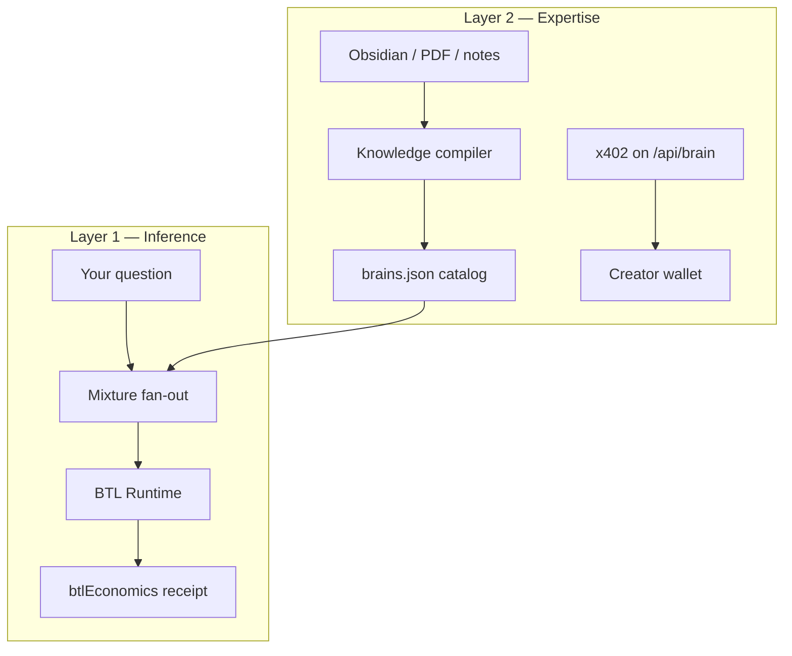
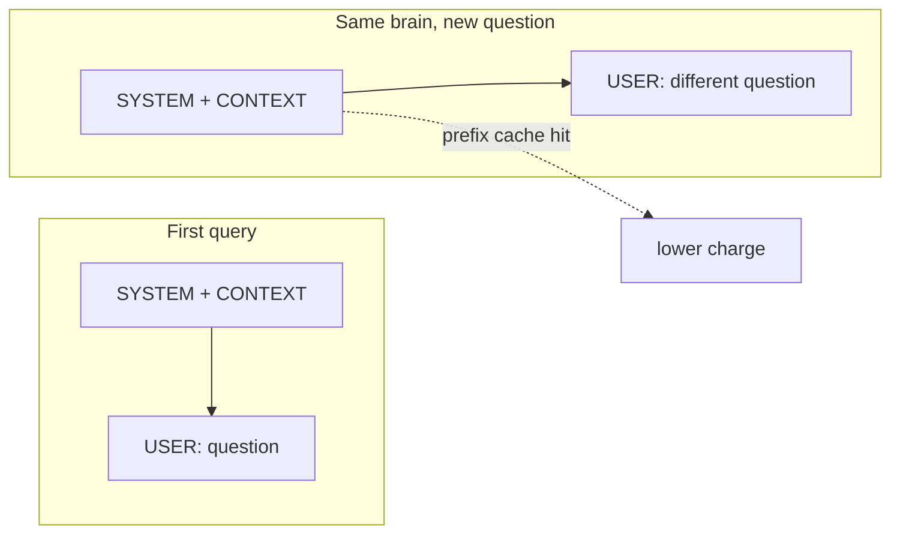
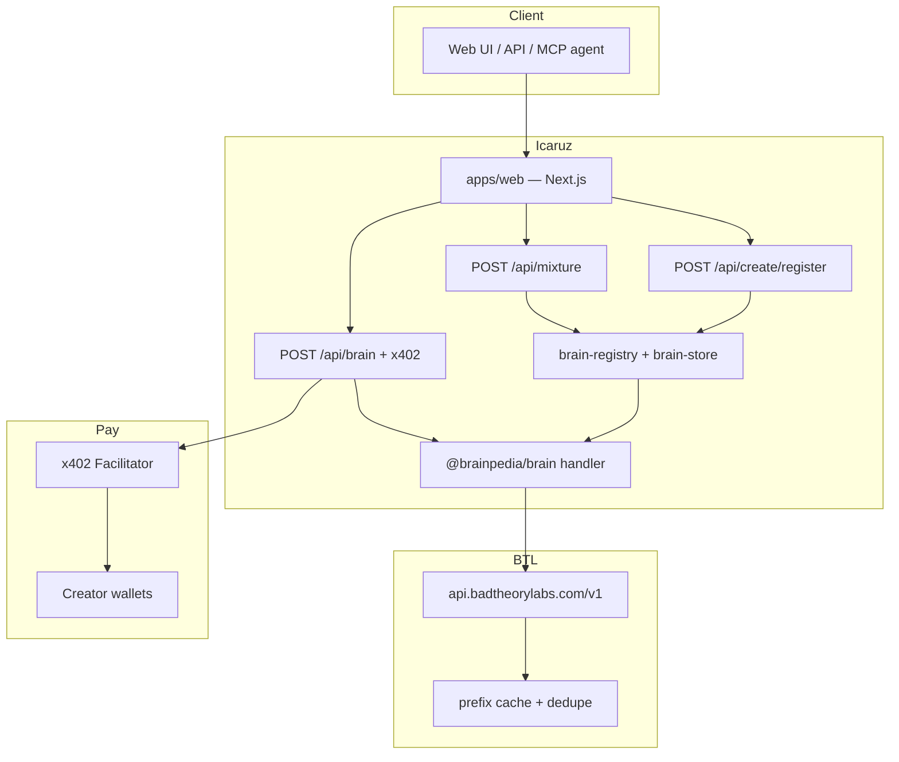
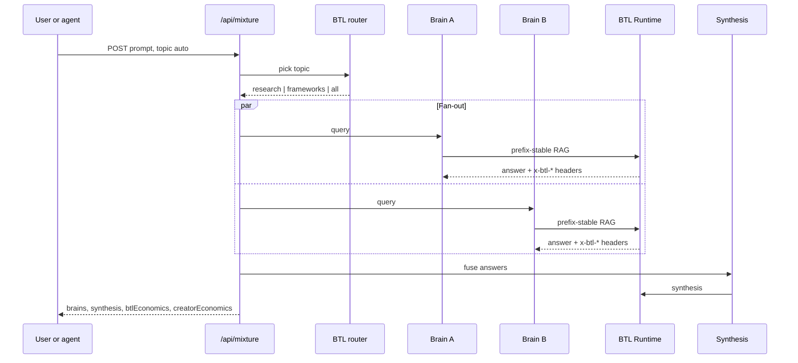

# Icaruz

**One question. Many experts. Pay once for context — pay the people who wrote it.**

You have an Obsidian vault full of research. A whitepaper you actually understand. Years of audit notes nobody else has. Today, when an agent needs that knowledge, one of two things happens: the context gets pasted into every parallel sub-call and billed N times, or the person who curated it gets nothing.

Icaruz fixes both. Ask once at [/ask](http://localhost:3000/ask). A router picks the right specialist brains, fans out in parallel, and synthesizes one answer. Stable wiki context stays in a fixed prompt prefix so [BTL Runtime](https://runtime.badtheorylabs.com/) can cache and dedupe on repeat — with a receipt that proves what you saved. Experts publish brains from their vaults and earn per query via [x402](https://www.x402.org/) micropayments.

---

## The pain

If you've built a multi-expert agent, you've felt this:

1. **Context gets rebilled.** Fan out to three specialists and you send the same 8k-token wiki three times. Standard gateways charge for that prefix three times. There is no ledger that says "you already paid for this block."

2. **Expertise has no price tag.** The researcher who spent six months in an Obsidian graph, the auditor who wrote the post-mortem, the protocol designer with the only good whitepaper summary — their notes become free RAG fodder. Agents query them; they see $0.

3. **Raw notes ≠ queryable knowledge.** Dumping a vault into a vector DB works once, then rots. Cross-links break. Summaries drift. Karpathy's [LLM Wiki](https://gist.github.com/karpathy/442a6bf555914893e9891c11519de94f) insight still holds: compile once into a maintained wiki, query the wiki forever.

Icaruz is built around all three.

---

## What it is

A web app, HTTP API, and MCP server that treat **compiled human expertise** as a first-class primitive:

| Piece | Role |
|---|---|
| **Brains** | Specialist knowledge bases — security, frameworks, domain research — each with a curated article graph |
| **Mixture** | One prompt → route by topic → parallel fan-out → synthesis |
| **Prefix-stable RAG** | Wiki articles in a fixed block; only the user question changes. BTL prefix cache hits on repeat |
| **Creator catalog** | Anyone can publish a brain: upload files or connect Obsidian, set a wallet, set a price |
| **Dual receipts** | `btlEconomics` (inference savings) + `creatorEconomics` (who to pay and how much) |

**Mental model:** A panel of specialists in a room. You ask once. They answer in parallel. A moderator synthesizes. The runtime remembers what they already read. The people who wrote the reading material get a cut.

---

## Who it's for

| You | What you do |
|---|---|
| **Someone with a question** | [/ask](http://localhost:3000/ask) — type a prompt, get a merged answer + cost receipt. Run it again; watch cache hits climb |
| **Someone with a vault** | [/create](http://localhost:3000/create) — drag markdown/PDF/Word, or **connect your Obsidian folder**. Name your brain, paste a wallet, set ~$0.01/query |
| **An agent / developer** | `POST /api/mixture` for multi-brain answers. `POST /api/brain` for one brain (402 until x402 paid). MCP tool `query_brain_x402` handles pay-and-retry |

---

## Knowledge in — brain out

Icaruz meets you where your notes already live.

### Obsidian

- **Web:** [/create](http://localhost:3000/create) → *connect obsidian* → pick your vault folder in the browser. Markdown notes compile into articles.
- **MCP / Claude Code:** Point at a vault path, or use the [Local REST API plugin](https://github.com/coddingtonbear/obsidian-local-rest-api) so your *running* Obsidian instance is the source of truth — no filesystem coupling.

`@brainpedia/obsidian-parser` walks the vault, respects `[[wikilinks]]`, skips `.obsidian` / `.trash`, and hands off to the compiler.

### Everything else

`@brainpedia/knowledge-compiler` ingests **markdown, plain text, PDF, and Word**. Segments by heading, builds an article graph with backlinks, outputs a Karpathy-style LLM wiki — the artefact agents actually query, not your raw dump.

### Where it lands

- **Local demo:** `apps/web/data/brains.json` + `data/snapshots/`
- **Optional:** 0G Storage upload via `@brainpedia/storage-0g` (merkle-rooted snapshots)
- **On-chain path:** ERC-7857 Brain iNFT + ENS discovery — see `apps/mcp-server` for the full mint/sync flow

---

## Two layers of money



| Layer | Who pays | Typical amount | What you get |
|---|---|---|---|
| **BTL** | Platform / querier (`GATEWAY_API_KEY`) | Fractions of a cent per call | Fast inference, prefix cache, `x-btl-*` proof headers |
| **Creator** | Agent or API client (x402) | ~$0.01–0.02 per brain query | USDC to the brain owner's wallet on Base |
| **Demo UI** | Nobody extra | $0 | `X402_SKIP_PAYMENT=true` lets humans try without a wallet |

BTL makes the *reading* cheap. x402 makes the *expertise* payable. A mixture response carries both receipts.

---

## Why prefix-stable RAG (not a base-URL swap)

BTL caches by prompt prefix. Most apps stuff the user question at the top and wonder why cache never hits.

Icaruz keeps structure fixed:

```
SYSTEM:    specialty + instructions     ← stable
CONTEXT:   compiled wiki articles       ← stable (this is what gets cached)
USER:      the actual question          ← only this changes
```

On mixture fan-out, every brain shares the same *pattern*: heavy prefix, light suffix. First query pays full freight. Second query on the same topic — `cacheHits` in `btlEconomics` go up, `totalSaved` goes up, and the UI shows it.



**Try it:** Ask the same security question twice on [/ask](http://localhost:3000/ask). The receipt is the proof.

---

## System overview



### Mixture sequence



---

## Brains catalog

### Built-in specialists

Ship in [`apps/web/src/lib/brain-registry.ts`](apps/web/src/lib/brain-registry.ts).

| Brain | Specialty | Topics |
|---|---|---|
| `yudhi` | EVM security, audits, incident post-mortems | research, all |
| `karpathy` | LLM wikis, knowledge management, agent design | frameworks, all |
| `0g-expert` | 0G Storage, compute, chain docs | research, all |

### Creator brains

Publish via [/create](http://localhost:3000/create):

1. Connect wallet (payout address).
2. Upload files **or connect Obsidian** → preview compile.
3. Set name, specialty, topics, price (default $0.01).
4. Brain lands in `brains.json` and `data/snapshots/`.

Creator brains appear in [/brains](http://localhost:3000/brains) and join mixture fan-out when their topic matches. `topic: "auto"` uses `BTL_ROUTER_MODEL` to pick `research`, `frameworks`, or `all`.

---

## BTL economics

Every brain call returns headers parsed into a ledger:

| Header | Meaning |
|---|---|
| `x-btl-request-id` | Trace ID |
| `x-btl-cache-tier` | Cache tier (empty = miss) |
| `x-btl-benchmark-cost` | List-price equivalent |
| `x-btl-customer-charge` | What BTL charged |
| `x-btl-saved` | Benchmark minus charge |

`POST /api/mixture` aggregates into `btlEconomics`:

```json
{
  "calls": 4,
  "cacheHits": 2,
  "totalBenchmarkCost": 0.000048,
  "totalCustomerCharge": 0.000132,
  "totalSaved": 0.000016,
  "savingsRate": 0.33,
  "byCacheTier": { "prefix": 2 }
}
```

Dry-run quote (no inference):

```bash
curl "http://localhost:3000/api/mixture?quote=1&prompt=What+is+reentrancy&topic=research"
```

---

## Creator economics (x402)

Mixture responses include `creatorEconomics` — per-brain wallet, price, settlement hint:

```json
{
  "brains": [
    { "id": "defi-auditor", "name": "defi-auditor", "wallet": "0x…", "priceUsd": 0.01, "paid": false }
  ],
  "totalUsd": 0.01,
  "x402": {
    "endpoint": "/api/brain",
    "instructions": "POST { prompt, target } per brain. Pay via x402, retry with payment header."
  }
}
```

**Agent flow:**

1. `POST /api/brain` with `{ "prompt", "target" }`.
2. Priced brain, unpaid → **402** with payment requirements.
3. Agent signs USDC (Base Sepolia default), retries with `X-PAYMENT` header.
4. **200** with answer + `creatorEconomics`.

**MCP:** `query_brain_x402` in `apps/mcp-server` runs the 402 → pay → retry loop.

---

## Quick start

**You need:** [Bun](https://bun.sh), a [BTL workspace key](https://runtime.badtheorylabs.com/), one terminal.

```bash
git clone https://github.com/arko05roy/Icaruz.git
cd Icaruz
bun install
cp .env.example .env
```

**Minimum `.env` for local demo:**

```bash
GATEWAY_API_KEY=gw_your_btl_workspace_key
BTL_RUNTIME_BASE_URL=https://api.badtheorylabs.com/v1
BTL_QUERY_MODEL=btl-2
BTL_ROUTER_MODEL=btl-2

ZG_WALLET_PRIVATE_KEY=0x...          # brain handler + optional 0G upload
BRAIN_ENS_NAME=yudhi.bpedia.eth
BRAIN_STORAGE_ROOT=0x...             # optional; demo articles if fetch fails
BRAIN_SPECIALTY=EVM security, audit methodology, incident post-mortems
BRAIN_ENFORCE_ACCESS_TOKENS=false

X402_SKIP_PAYMENT=true               # humans try UI without paying
```

**Run:**

```bash
bun run dev --filter=@brainpedia/web
```

| URL | What |
|---|---|
| http://localhost:3000 | Landing |
| http://localhost:3000/ask | Mixture query + dual receipts |
| http://localhost:3000/brains | Brain catalog |
| http://localhost:3000/create | Publish a brain (upload or Obsidian) |
| http://localhost:3000/status | Health check |

---

## API

### `POST /api/mixture`

Multi-brain fan-out + synthesis. Platform pays BTL; no x402 gate on this path.

```bash
curl -X POST http://localhost:3000/api/mixture \
  -H 'content-type: application/json' \
  -d '{"prompt":"What is reentrancy?","topic":"auto"}'
```

| Field | Values |
|---|---|
| `prompt` | User question (required) |
| `topic` | `auto` · `all` · `research` · `frameworks` |

Response: `brains[]`, `synthesis`, `btlEconomics`, `creatorEconomics`.

### `POST /api/brain`

Single-brain query. x402 required for priced creator brains (unless `X402_SKIP_PAYMENT=true`).

```bash
curl -X POST http://localhost:3000/api/brain \
  -H 'content-type: application/json' \
  -d '{"prompt":"Explain LLM wikis","target":"karpathy"}'
```

### `POST /api/create/register`

Multipart: `owner`, `payoutWallet`, `name`, `specialty`, `priceUsd`, `topics`, `files[]`. Compiles knowledge, saves snapshot, registers brain.

### `POST /api/create?step=preview`

Preview compilation only — same multipart `files` + `owner`, no register.

---

## Repository layout

```
Icaruz/
├── apps/
│   ├── web/                 Next.js UI, mixture/brain/create APIs, x402
│   │   └── data/            brains.json + snapshots/ (creator catalog)
│   ├── brain/               In-process query handler
│   └── mcp-server/          Claude MCP — setup_brain, sync_vault, query_brain_x402
├── packages/
│   ├── compute-btl/         BTL client, economics, prefix-stable prompts
│   ├── knowledge-compiler/  Obsidian / PDF / DOCX → wiki articles
│   ├── obsidian-parser/     Vault walk, wikilinks, REST API reader
│   ├── storage-0g/          Optional 0G snapshot upload/fetch
│   └── ens/                 ENS discovery (on-chain path)
├── scripts/demo/            Sample vault markdown (karpathy-vault)
└── contracts/               ERC-7857 Brain iNFT (on-chain path)
```

---

## Tech stack

| Layer | Choice |
|---|---|
| Monorepo | Bun workspaces + Turborepo |
| Web | Next.js 15, Tailwind, App Router |
| Inference | [BTL Runtime](https://runtime.badtheorylabs.com/docs) (`btl-2`) |
| Creator payouts | [x402](https://docs.x402.org/) (`@x402/next`, Base Sepolia) |
| Knowledge | Obsidian vaults, PDF, DOCX → compiled article graphs |
| Agents | MCP server with pay-and-retry |

---

## Environment

Full template: [`.env.example`](.env.example)

| Variable | Purpose |
|---|---|
| `GATEWAY_API_KEY` | BTL Runtime workspace key |
| `BTL_QUERY_MODEL` / `BTL_ROUTER_MODEL` | Q&A and topic routing |
| `ZG_WALLET_PRIVATE_KEY` | Brain handler signer; MCP x402 payments |
| `BRAIN_*` | Default in-process brain identity |
| `BRAINS_DATA_DIR` | Override catalog path |
| `X402_FACILITATOR_URL` | x402 facilitator |
| `X402_NETWORK` | e.g. `eip155:84532` (Base Sepolia) |
| `X402_SKIP_PAYMENT` | `true` for human demo without wallet |
| `OBSIDIAN_REST_API_KEY` | Local REST API plugin (MCP path) |
| `ICARUZ_API_URL` | Base URL for MCP `query_brain_x402` |

---

## Links

- **Repo:** https://github.com/arko05roy/Icaruz
- **BTL Runtime:** https://runtime.badtheorylabs.com/
- **BTL API docs:** https://runtime.badtheorylabs.com/docs
- **x402:** https://www.x402.org/
- **MCP server:** [`apps/mcp-server/README.md`](apps/mcp-server/README.md)

---

## License

MIT
